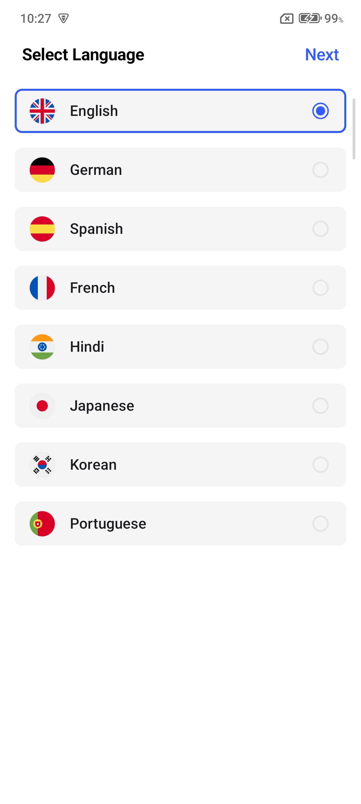
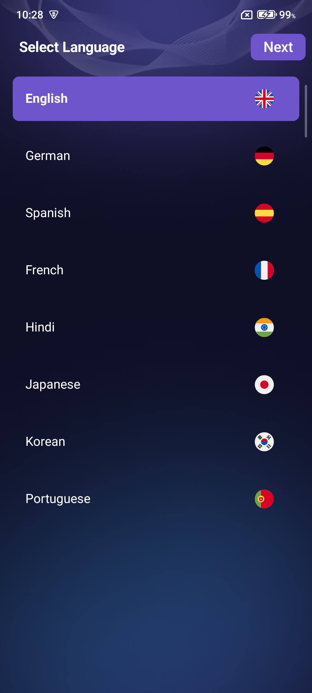

Apero First Open Library Sample
==================

This is a repository for demonstrating how to use Apero First Open Library.

Apero First Open Library takes care of showing Splash Ads and first open flow (Language FO,
Onboard...)

## Requirements (Skip this if already done)

### Set up Apero Ads Module: Follow the setup steps in [Setup Guide](docs/SetupSDK.md)

To run this sample project, open ``settings.gradle.kts`` in the root of project and provide
given ``username`` and ``password`` inside ``credentials``
block.

```kotlin
maven {
    url = uri("https://artifactory.apero.vn/artifactory/gradle-release/")
    credentials {
        username = "" // Username here
        password = "" // Password here
    }
}
```

### Add library to app module

Inside app module's build.gradle, add implementation for library:

```
implementation("apero.aperosg.firstopen:firstopen:1.0.7-alpha05")
```

# Table of Contents

1. [Structure](#1-structure)
2. [Configure Splash screen](#2-configure-splash-screen)
3. [Configure Language First Open screen](#3-configure-language-first-open-screen)
4. [Configure Welcome screen (Optional)](#4-configure-welcome-screen-optional)
5. [Configure Onboard screens](#5-configure-onboard-screens)
6. [Configure Ads](#configure-ads)
7. [Start flow](#start-flow)
8. [Customization](#customization)

# [**1. Structure**](#1-structure)

1. Create a FirstOpenActivity and make it launcher activity in Manifest
   ```xml
    <activity
        android:name=".FirstOpenActivity"
        android:configChanges="locale|layoutDirection|orientation|screenLayout|uiMode|touchscreen|screenSize|smallestScreenSize"
        android:exported="true">
        <intent-filter>
            <action android:name="android.intent.action.MAIN" />
            <category android:name="android.intent.category.LAUNCHER" />
        </intent-filter>
    </activity>
   ```

   **Important: do not forget ``configChanges`` line, Activity on some devices is restarted after
   changing language and causing bugs.**

2. Inside FirstOpenActivity, start setting up flow and launch.

   Details: [Source file](app/src/main/java/apero/aperosg/monetizationsample/FirstOpenActivity.kt)

    ```kotlin
    class FirstOpenActivity : AppCompatActivity() {
        override fun onCreate(savedInstanceState: Bundle?) {
            super.onCreate(savedInstanceState)
    
            setupFirstOpenFlow()
            finish()
        }
    
        private fun setupFirstOpenFlow() {
            // Set up callback
            val callback = object : AperoFOCallback() {
                override fun onConsentResult(canLoadAds: Boolean) {
                    // Do something if user consent/doesn't consent
                }
    
                override fun onLanguageConfirm(language: Language) {
                    // Do something when user confirm language
                    // Such as save language to Preferences...
                }
   
                 override fun onOnboardPageChanged(currentPage: Int, totalPage: Int) {
                       // Do something when onboard page change
                       // Such as preload ad 
                   }    
    
                override fun onFinished() {
                    // Go to next screen
                }
            }
    
            // Set up ads config
            val adsConfig = AperoFOAdsConfig.Builder()
                // Details ads config here
                .build()
    
            // Set up Splash screen config
            val splashConfig = AperoSplashUiConfig.Builder()
                // Details splash screen config here
                .build()
    
            // Set up Language FO screen config
            val languageConfig = AperoLanguageUiConfig.Builder()
                // Details language config here
                .build()
    
            // Set up Welcome screen config
            // Skip if there's no welcome screen
            val welcomeConfig = AperoWelcomeUiConfig.Builder()
                // Details welcome config here
                .build()
    
            // Set up Onboard screens config
            // Config for onboard screen 1
            val onboard1Config = AperoOnboardPageConfig(layoutOnboardContentId = R.layout.layout_onboard_1)
            // Config for onboard screen 2
            val onboard2Config = AperoOnboardPageConfig(layoutOnboardContentId = R.layout.layout_onboard_2)
            // Config for onboard screen 3
            val onboard3Config = AperoOnboardPageConfig(layoutOnboardContentId = R.layout.layout_onboard_3)
            // Combine config for onboard screens
            val onboardConfig = AperoOnboardUiConfig(pagesConfig = listOf(onboard1Config, onboard2Config, onboard3Config))
    
            // Assemble configs
            val config = AperoFOConfig.Builder()
                .setCallback(callback)
                .setAdsConfig(adsConfig)
                .setSplashUiConfig(splashConfig)
                .setLanguageUiConfig(languageConfig)
                .setWelcomeUiConfig(welcomeConfig)
                .setOnboardUiConfig(onboardConfig)
                .build()
    
            // Start first open flow
            AperoFO.startFlow(this, config)
        }
    }
    ```

# [**2. Configure Splash screen**](#2-configure-splash-screen)

Full config options: [Documentation](docs/SplashConfigOptions.md)

This step setups UI for splash screen, you can choose to use prebuilt Splash screen or provide your
own layout

- Use prebuilt splash screen:
   ```kotlin
   val splashConfig = AperoSplashUiConfig.Builder()
   .setAppIconId(R.drawable.app_icon) // Provide app icon
   .build()
   ```
- Use custom layout:
   ```kotlin
  val splashConfig = AperoSplashUiConfig.Builder()
  .setCustomSplashLayoutId(R.layout.layout_splash) // Provide custom layout
  .build()
   ```

-

## Additional initialization in Splash (Optional if you have other initializations)

If you have any other initializations that needs to be done in Splash screen such as remote configs,
follow these instructions:

- Call ``.setWaitForInitialization(true)`` in SplashUiConfig Builder
- Call ``AperoFO.startFlow()`` to start follow as usual
- Start your initializations and call ``AperoFO.finishSplashInitialization()`` when you're done

Sample
file: [Source file](app/src/main/java/apero/aperosg/monetizationsample/FirstOpenWithSplashInitializationActivity.kt)

# [**3. Configure Language First Open screen**](#3-configure-language-first-open-screen)

This step setups languages in Language screen, you provides list of languages to show in Language FO
screen.

Full config options: [Documentation](docs/LanguageConfigOptions.md)

```kotlin
val languageConfig = AperoLanguageUiConfig.Builder()
    .setLanguages(
        listOf(
            Language.English,
            Language.German,
            // Other languages
        )
    )
    //.setPrimaryColor(Color.BLUE) // Set Primary color of the screen
    //.setNextButtonStyle(ButtonStyle.Solid) // Set next button style
    .build()
```

List of supported languages:
``Arabic(ar), Bangla(bn), Chinese(zh), Czech(cz), Danish(da),
Dutch(nl), English(en), Finnish(fi), Filipino(fil), French(fr),
German(de), Hindi(hi), Indonesian(in), Italian(it), Japanese(ja),
Korean(ko), Malay(ms), Marathi(mr), Portuguese(pt), Russian(ru),
Spanish(es), Tamil(ta), Telugu(te), Thai(th), Turkish(tr),
Urdu(ur), Vietnamese(vi)``

### Language settings

The library also provides a **Language Settings** screen if user finishes first open flow.
To launch Language Settings screen:

```kotlin
startActivity(Intent(context, LanguageSettingsActivity::class.java))
```

You can also use your custom **Language Settings** screen but
call ``AperoFO.setLanguage(languageCode)`` if you change language.

### Customize Language Selector with XML

If you don't want to use default layout for language xml below:
<p align="center">

</p>

And you want to use your customized language element xml like this
<p align="center">
    
</p>

To implement a custom layout for the language element in the Language First Open screen, follow
these steps:

1. **Create Your Custom Layout**: First, design your custom layout XML file for the language
   element. For instance, create two files named `layout_language_element.xml` &
   `layout_language_element_chosen.xml` under `res/layout` directory. Their content will look like
   the following code snippet:

   ```xml
   <!-- res/layout/custom_language_item.xml -->
    <?xml version="1.0" encoding="utf-8"?>
    <LinearLayout xmlns:android="http://schemas.android.com/apk/res/android"
        android:layout_width="match_parent" android:layout_height="wrap_content"
        android:orientation="horizontal" android:background="@color/blue_500" android:padding="16dp">
    
        <!--tag languageFlag is required in your customized layout-->
        <ImageView android:tag="languageFlag" android:layout_width="40dp" android:layout_height="24dp"
            android:layout_marginEnd="8dp" android:contentDescription="Flag"
            android:src="@drawable/app_icon" />
    
        <!--tag languageName is required in your customized layout-->
        <TextView android:tag="languageName" android:layout_width="wrap_content"
            android:layout_height="wrap_content" android:text="Phong-Kaster" android:textSize="16sp"
            android:textColor="@android:color/black" />
    </LinearLayout>
   ```

Note: Ensure that you use the exact [***android:tag=languageFlag***](#) & [
***android:tag=languageName***](#) in the custom layout to enable correct property mapping by the
library.

2. **Set the Custom Layout in the Configuration**: Configure the `AperoLanguageUiConfig` to use your
   custom layout by specifying the layout resource ID.

   ```kotlin
   val languageConfig = AperoLanguageUiConfig.Builder()
       .setLanguages(
           listOf(
               Language.English,
               Language.German,
               // Add additional languages as needed
           )
       )
       // set text color for "Select language"
        .setTitleColor(0xFFFFFF00.toInt()) 
   
       // set custom image background instead of default background color
        .setCustomImageBackground(R.drawable.img_language_background)
   
       // set custom language layout with layout_language_element.xml 
       .setCustomLanguageLayoutId(R.layout.layout_language_element)
   
       // set custom language layout when user select language layout_language_element_chosen.xml
       .setCustomChosenLanguageLayoutId(R.layout.layout_language_element_chosen) 
       .build()
   ```


| Function                            | Description                                                                                            |
|-------------------------------------|--------------------------------------------------------------------------------------------------------|
| setLanguages                        | Sets the list of languages to be displayed in the Language First Open screen.                          |
| setPrimaryColor                     | Sets the primary color of the elements on the Language First Open screen.                              |
| setNextButtonStyle                  | Sets the style for the next button, such as solid, outline, or normal.                                 |
| setTitleColor                       | Sets the text color for the "Select language" title.                                                   |
| setCustomImageBackground            | Sets a custom drawable resource as the background image for the language selection screen.             |
| setCustomLanguageLayoutId           | Sets a custom layout resource ID for language elements in the Language First Open screen.             |
| setCustomChosenLanguageLayoutId     | Sets a custom layout resource ID for the selected language element in the Language First Open screen.  |


3. **Configure the First Open Flow**: Ensure your configuration is correctly set up within your
   `FirstOpenActivity`.

   ```kotlin
   private fun setupFirstOpenFlow() {
       val config = AperoFOConfig.Builder()
           .setLanguageUiConfig(languageConfig)
           .build()

       AperoFO.startFlow(this, config)
   }
   ```

By following these steps, you can implement a custom layout for the language element in the Language
First Open screen, giving you greater control over the visual appearance and functionality.

# [**4. Configure Welcome screen (Optional)**](#4-configure-welcome-screen-optional)

This step setups Welcome screen (screen between Language FO and Onboard).

- Upon an event that triggers dup screen, call ``AperoFO.showWelcomeDupScreen()``
- Upon an event that complete welcome screen, call ``AperoFO.completeWelcomeScreen()``

Full config options: [Documentation](docs/WelcomeConfigOptions.md)

### Using XML:

Refer to
file [Source file](app/src/main/java/apero/aperosg/monetizationsample/FirstOpenWelcomeXMLActivity.kt)

```kotlin
private fun setupFirstOpenFlow() {
    //...
    val welcomeConfig = AperoWelcomeUiConfig.Builder()
        .setViewContentProvider { setUpWelcomeScreen() }
        .build()
    //...
}

private fun setUpWelcomeScreen(): View {
    val welcomeScreenView = layoutInflater.inflate(R.layout.layout_welcome_scr, null, false)
    // Setup your welcome screen layout here
    return welcomeScreenView
}
```

### Using Jetpack Compose:

Refer to
file [Source file](app/src/main/java/apero/aperosg/monetizationsample/FirstOpenWelcomeComposeActivity.kt)

```kotlin
private fun setupFirstOpenFlow() {
    //...
    val welcomeConfig = AperoWelcomeUiConfig.Builder()
        .setComposableContent { WelcomeScreenContent() }
        .build()
    //...
}

@Composable
private fun WelcomeScreenContent() {
    // Set up your welcome screen layout here
}
```

# [**5. Configure Onboard screens**](#5-configure-onboard-screens)

Full config options: [Documentation](docs/OnboardConfigOptions.md)

<details>
    <summary>Onboard screens with only one native onboard fullscreen</summary>

### Step 1: Create Onboarding Page Configurations

Start by defining three **AperoOnboardPageConfig** objects, one for each onboarding screen. Ensure
these configurations are created in the order you
want them to appear: 1, 2, 3.

```kotlin
val onboard1Config = AperoOnboardPageConfig()
val onboard2Config = AperoOnboardPageConfig()
val onboard3Config = AperoOnboardPageConfig()
```

### Step 2: Add UI Content to Each Onboarding Page

To customize the UI for each onboarding screen, you can assign a layout resource ID or a Composable
function to the corresponding *
*AperoOnboardPageConfig** object.

### Using XML Layouts

If your onboarding screens are defined using XML layouts, simply assign the layout resource ID to
each  **AperoOnboardPageConfig** object.

```kotlin
val onboard1Config = AperoOnboardPageConfig(layoutOnboardContentId = R.layout.layout_onboard_1)
val onboard2Config = AperoOnboardPageConfig(layoutOnboardContentId = R.layout.layout_onboard_2)
val onboard3Config = AperoOnboardPageConfig(layoutOnboardContentId = R.layout.layout_onboard_3)
```

### Using Jetpack Compose

If you prefer to define your onboarding screens with Jetpack Compose, you can pass a Composable
function directly to each **AperoOnboardPageConfig**
object:

```kotlin
val onboard1Config = AperoOnboardPageConfig(composableContent = { OnboardScreen1Compose() })
val onboard2Config = AperoOnboardPageConfig(composableContent = { OnboardScreen2Compose() })
val onboard3Config = AperoOnboardPageConfig(composableContent = { OnboardScreen3Compose() })
```

### Step 3: Configure the Onboarding UI

Create an AperoOnboardUiConfig object to customize the appearance of the onboarding screens. Pass
the previously created **AperoOnboardPageConfig**
objects into this configuration.

| Parameter           | Description                                                                             |
|---------------------|-----------------------------------------------------------------------------------------|
| **primaryColor**    | Color of the elements on onboarding screen such as indicators, next button, ads buttons |
| **backgroundColor** | Background color of the onboarding screen                                               |

```kotlin
val onboardConfig = AperoOnboardUiConfig(
    primaryColor = yourPrimaryColor,
    backgroundColor = yourBackgroundColor,
    pagesConfig = listOf(onboard1Config, onboard2Config, onboard3Config)
)
```

### Configure Ads

First Open library takes care of showing splash ads and first open ads, to do that you have to
provide the ads id.

Full config options: [Documentation](docs/AdsConfigOptions.md)

Example:

```kotlin
// Set up ads config
val adsConfig = AperoFOAdsConfig.Builder()
    .setInterSplashHighId(BuildConfig.inter_splash_high)
    .setInterSplashId(BuildConfig.inter_splash)
    // More ads id
    .build()
```

### Start flow

After configuring everything, it's time to assemble configs and start the flow

```kotlin
// Assemble configs
val config = AperoFOConfig.Builder()
    .setCallback(callback)
    .setAdsConfig(adsConfig)
    .setSplashUiConfig(splashConfig)
    .setLanguageUiConfig(languageConfig)
    .setWelcomeUiConfig(welcomeConfig)
    .setOnboardUiConfig(onboardConfig)
    .build()

// Start first open flow
AperoSGFO.startFlow(this, config)
```

</details>

<details>
    <summary>Onboard screens with two native onboard fullscreen</summary>

### Step 1: Firebase Configuration for Onboard Screens

To ensure, your application displays two native onboard fullscreen advertisements, follow these
steps:

1. <b>Open your Firebase project.</b>

2. <b>Add a key named `enable_two_native_onboard_fullscreen` and set its default value to true</b>

<b>Advertisement Order for Onboard Screens</b>

When `enable_two_native_onboard_fullscreen` is set to `true`, the order of advertisements will be:

1. Start
2. Splash
3. Language First Open
4. Welcome (optional)
5. Onboard 1
6. <b>Native Onboard Fullscreen 1</b>
7. Onboard 2
8. <b>Native Onboard Fullscreen 2</b>
9. Onboard 3
10. Onboard 4 (optional)
11. Finish

<b>Handling Internet Issues</b>

If there is an issue with the Internet, the Remote Config will set
`enable_two_native_onboard_fullscreen` to `false` by default. In this case, only Native Onboard
Fullscreen 1 will be shown. The order of advertisements will be:

1. Start
2. Splash
3. Language First Open
4. Welcome (optional)
5. Onboard 1
6. Onboard 2
7. <b>Native Onboard Fullscreen 1</b>
8. Onboard 3
9. Onboard 4 (optional)
10. Finish

On the section [configure ad](#configure-ads), take a notice when set
up `native_onboard_1_fullscreen` & `native_onboard_2_fullscreen`

### Step 2: Create Onboarding Page Configurations

Start by defining three **AperoOnboardPageConfig** objects, one for each onboarding screen. Ensure
these configurations are created in the order you
want them to appear: 1, 2, 3.

```kotlin
val onboard1Config = AperoOnboardPageConfig()
val onboard2Config = AperoOnboardPageConfig()
val onboard3Config = AperoOnboardPageConfig()
```

### Step 3: Add UI Content to Each Onboarding Page

To customize the UI for each onboarding screen, you can assign a layout resource ID or a Composable
function to the corresponding *
*AperoOnboardPageConfig** object.

### Using XML Layouts

If your onboarding screens are defined using XML layouts, simply assign the layout resource ID to
each  **AperoOnboardPageConfig** object.

```kotlin
val onboard1Config = AperoOnboardPageConfig(layoutOnboardContentId = R.layout.layout_onboard_1)
val onboard2Config = AperoOnboardPageConfig(layoutOnboardContentId = R.layout.layout_onboard_2)
val onboard3Config = AperoOnboardPageConfig(layoutOnboardContentId = R.layout.layout_onboard_3)
```

### Using Jetpack Compose

If you prefer to define your onboarding screens with Jetpack Compose, you can pass a Composable
function directly to each **AperoOnboardPageConfig**
object:

```kotlin
val onboard1Config = AperoOnboardPageConfig(composableContent = { OnboardScreen1Compose() })
val onboard2Config = AperoOnboardPageConfig(composableContent = { OnboardScreen2Compose() })
val onboard3Config = AperoOnboardPageConfig(composableContent = { OnboardScreen3Compose() })
```

### Step 4: Configure the Onboarding UI

Create an AperoOnboardUiConfig object to customize the appearance of the onboarding screens. Pass
the previously created **AperoOnboardPageConfig**
objects into this configuration.

| Parameter            | Description                                                                             |
|----------------------|-----------------------------------------------------------------------------------------|
| **primaryColor**     | Color of the elements on onboarding screen such as indicators, next button, ads buttons |
| **backgroundColor**  | Background color of the onboarding screen                                               |
| **nextButtonStyle**  | Style of next button, either Normal, Solid or Outline                                   |
| **startButtonStyle** | Style of start button, either Normal, Solid or Outline                                  |

```kotlin
val onboardConfig = AperoOnboardUiConfig(
    primaryColor = yourPrimaryColor,
    backgroundColor = yourBackgroundColor,
    pagesConfig = listOf(onboard1Config, onboard2Config, onboard3Config)
)
```

## Configure Ads

First Open library takes care of showing splash ads and first open ads, to do that you have to
provide the ads id.

Full config options: [Documentation](docs/AdsConfigOptions.md)

Example:

```kotlin
// Set up ads config
val adsConfig = AperoFOAdsConfig.Builder()
    .setInterSplashHighId(BuildConfig.inter_splash_high)
    .setInterSplashId(BuildConfig.inter_splash)
    // More ads id
    .setNativeOnboardFullscreenId(BuildConfig.native_ob_fullscr) // set up native_onboard_1_fullscreen
    .setNativeOnboardFullscreenHighId(BuildConfig.native_ob_fullscr_high)
    .setNativeOnboardFullscreen2Id(BuildConfig.native_ob_fullscr_2) // set up native_onboard_2_fullscreen
    .setNativeOnboardFullscreen2HighId(BuildConfig.native_ob_fullscr_2_high)
    .build()
```

### Start flow

After configuring everything, it's time to assemble configs and start the flow

```kotlin
// Assemble configs
val config = AperoFOConfig.Builder()
    .setCallback(callback)
    .setAdsConfig(adsConfig)
    .setSplashUiConfig(splashConfig)
    .setLanguageUiConfig(languageConfig)
    .setWelcomeUiConfig(welcomeConfig)
    .setOnboardUiConfig(onboardConfig)
    .build()

// Start first open flow
AperoSGFO.startFlow(this, config)
```

</details>

To use linear gradient in Onboard serial screens, we provide background gradient property. Remember,
background gradient requires at least two colours to work properly.

   ```kotlin
   val onboardConfig = AperoOnboardUiConfig(
    startButtonStyle = ButtonStyle.Outline,
    pages = listOf(onboard1Config, onboard2Config, onboard3Config, onboard4Config),
    nextButtonStyle = ButtonStyle.Normal,
    backgroundColor = 0xFF0F0F27,
    backgroundGradient = listOf(
        // at lease 2 colours. Otherwise, throw exceptions
        0xFF0F0F27,
        0xFF0F0F26,
        0xFF0F1129,
        0xFF1A244B,
    ),
    primaryColor = 0xFF27B8CD,
)
   ```

`Note: If both backgroundColor & backgroundGradient are filled with colours. Background gradient will be used instead of background color`

# [**6. Customization**](#6-customization)

### Ads layout customization

If no ads layout are provided, the library use default layout. To provide custom layouts, call
Builder functions:

| Function                                         | Description                                          |
|--------------------------------------------------|------------------------------------------------------|
| **setCustomNativeLanguageLayoutId**              | Set custom layout for native language and dup        |
| **setCustomNativeLanguageMetaLayoutId**          | Set custom meta layout for native language and dup   |
| **customNativeWelcomeLayoutId**                  | Set custom layout for native welcome and dup         |
| **customNativeWelcomeMetaLayoutId**              | Set custom meta layout for native welcome and dup    |
| **setCustomNativeOnboardLayoutId**               | Set custom layout for native onboard                 |
| **setCustomNativeOnboardMetaLayoutId**           | Set custom meta layout for native onboard            |
| **setCustomNativeOnboardFullscreenLayoutId**     | Set custom layout for native onboard fullscreen      |
| **setCustomNativeOnboardFullscreenMetaLayoutId** | Set custom meta layout for native onboard fullscreen |

For example:

```kotlin
val config = AperoSGFOConfig.Builder()
    // Other configs

    .setCustomNativeOnboardLayoutId(R.layout.ad_native_onboard_custom)
    .setCustomNativeOnboardMetaLayoutId(R.layout.ad_native_onboard_meta_custom)
    .setCustomNativeOnboardFullscreenLayoutId(R.layout.ad_native_onboard_fullscreen_custom)
    .setCustomNativeOnboardFullscreenMetaLayoutId(R.layout.ad_native_onboard_fullscreen_custom)

    .build()
```
